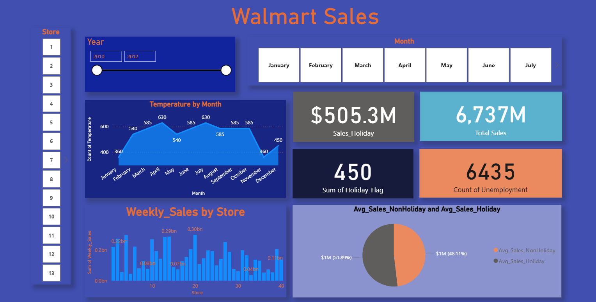

# Walmart Sales Dashboard (Power BI Project)

This project presents an interactive Power BI dashboard built to analyze Walmart sales data from 2010 to 2012.

## 🚀 Features

- Total Sales: $6.74B
- Holiday Sales: $505.3M
- Holiday Weeks: 450
- Unemployment Records: 6,435
- Avg Weekly Sales:
  - Non-Holiday: 51.89%
  - Holiday: 48.11%
- Monthly temperature trends
- Weekly sales by store
- Dynamic filters by year and month

## 🧰 Tools & Technologies

- Power BI
- Power Query (for data cleaning & transformation)
- DAX (for calculated measures and KPIs)
- CSV dataset

## 📸 Dashboard Preview

## 📂 Files Included

- `Walmart_Sales.csv`: Raw dataset
- `Walmart Sales.pbix`: Power BI dashboard file
- `Walmart dashboard.png`: Screenshot of the dashboard
